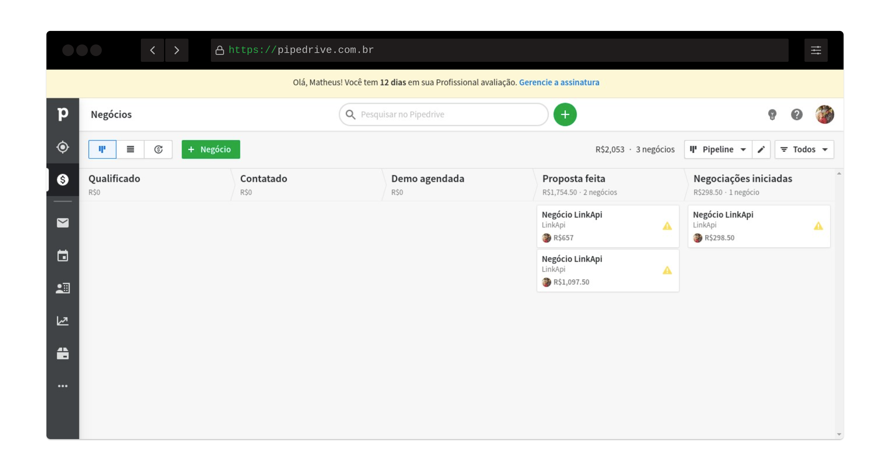
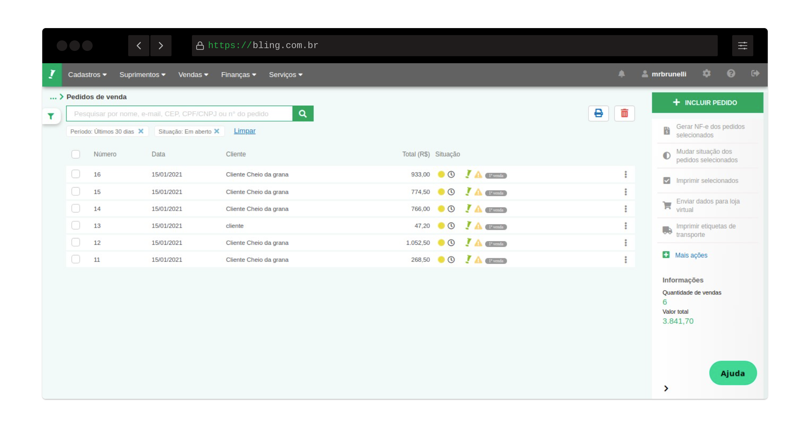
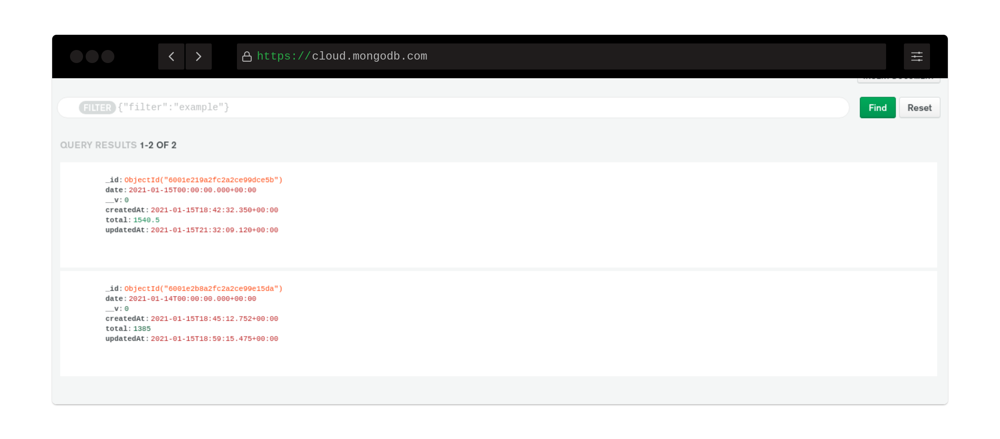

# LinkApi | Rest Integration
> Integrate Bling Platform with Pipedrive Won Deals

## [API DOCS Here :D](https://github.com/mrbrunelli/linkapi-rest/blob/master/APIDOCS.md)

## Environment variables
```javascript
PORT // Server port
DB_URI // Atlas URI MongoDB
DB_NAME
PIPEDRIVE_TOKEN
BLING_TOKEN
```

## How to run
```shell
# Node 12+
# Npm 6+
npm install && npm start
```

# Successfully Rest Integration
### Get Deals from Pipedrive Platform


### Insert Deals in Bling Platform


### Total of Orders Value Integrated per Day
